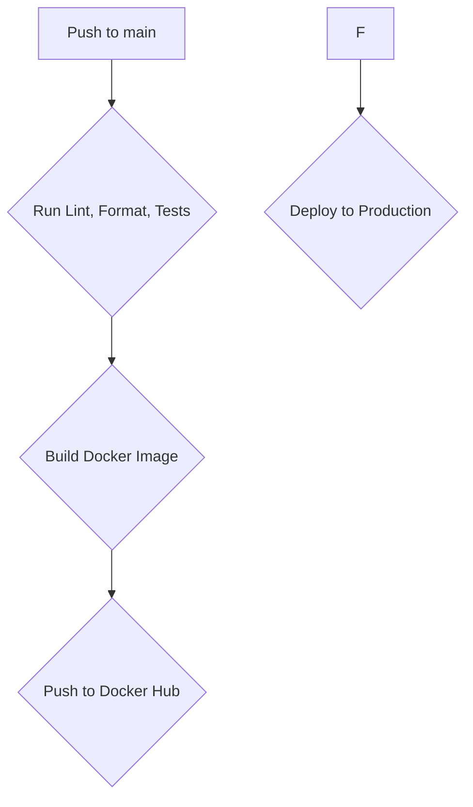

# hellok8s-nextjs

[](https://github.com/denibertovic/hellok8s-nextjs/actions/workflows/cicd.yml)

A comprehensive Next.js project template with CI/CD pipeline for deploying to Kubernetes. This project demonstrates modern web development practices using Nix, devenv, Docker, Helm, Kubernetes, and GitHub Actions.

## Project Focus

**This repository is primarily a showcase of modern DevOps tooling and deployment practices rather than Next.js application development.** The Next.js application itself is intentionally simple (basic user authentication and posts) to keep the focus on the infrastructure and deployment pipeline.
The Initial scaffolding of the NextJs app was done with the excellent [create-t3-app](https://create.t3.gg/).

### What This Project Demonstrates

**DevOps & Infrastructure:**

- **Reproducible Development**: Using Nix and devenv for consistent development environments
- **Containerization**: Optimized Docker build
- **Kubernetes Deployment**: Helm charts with environment-specific configurations
- **Secrets Management**: SOPS for encrypted secrets in version control
- **CI/CD Pipeline**: GitHub Actions with reusable workflows
- **AI Development Tools**: Pre-installed AI agents (Amp, Claude, Gemini, etc.)

**Next.js Best Practices (minimal but important):**

- **T3 Stack**: TypeScript, tRPC, Tailwind CSS, and NextAuth.js
- **Database**: PostgreSQL with Drizzle ORM
- **Authentication**: NextAuth.js with credential-based auth
- **Testing**: Vitest for unit and integration testing
- **Styling**: Tailwind CSS
- **Type Safety**: End-to-end type safety with tRPC
- **Rate Limiting**: Built-in API route protection (with Redis)
- **Fast Testing**: Transaction rollbacks and MD5 hashing for speedy database tests

### What This Project Does NOT Focus On

- Complex Next.js application architecture
- Advanced React patterns or state management
- Complex database relationships or advanced Drizzle features
- Advanced authentication strategies beyond basic credentials

If you're looking to learn Next.js application development, this project provides a solid foundation but focuses more on getting that application reliably deployed and managed in production.

## Table of Contents

- [Prerequisites](#prerequisites)
- [Local Development Setup](#local-development-setup)
- [Running the Application](#running-the-application)
- [AI Development Tools](#ai-development-tools)
- [Development Commands](#development-commands)
- [Testing](#testing)
- [Project Structure](#project-structure)
- [CI/CD Pipeline](#cicd-pipeline)
- [Deployment](#deployment)
- [Secrets Management](#secrets-management)
- [Using as a Template](#using-as-a-template)
- [GitHub Secrets Configuration](#github-secrets-configuration)
- [Troubleshooting](#troubleshooting)

## Prerequisites

Before you begin, you'll need to install several tools to work with this project effectively.

### 1. Install Nix

First, you need to install Nix, a powerful package manager that ensures reproducible development environments.

**For macOS users** (and others who want the best experience), I strongly recommend using the [Determinate Systems Nix installer](https://github.com/DeterminateSystems/nix-installer):

```bash
curl --proto '=https' --tlsv1.2 -sSf -L https://install.determinate.systems/nix | sh -s -- install --determinate
```

This installer provides better defaults and improved user experience compared to the official installer. For more details, visit: https://docs.determinate.systems/determinate-nix/

**If you want**, you can use the official installer (but you'll probably need to manually enable nix flakes):

```bash
sh <(curl -L https://nixos.org/nix/install) --daemon
```

After installation, restart your terminal or source your shell profile.

### 2. Install devenv

[devenv](https://devenv.sh) is a tool that creates reproducible development environments using Nix. Install it with:

```bash
nix profile install nixpkgs#devenv
```

### 3. Install direnv

[direnv](https://direnv.net/) automatically loads environment variables when you enter a directory. This integrates perfectly with devenv.

**On macOS:**

```bash
brew install direnv
```

**Or via nix:**

```bash
nix profile install nixpkgs#direnv
```

**Shell Integration:**
Add the following to your shell configuration file (`~/.bashrc`, `~/.zshrc`, etc.):

```bash
eval "$(direnv hook bash)"  # for bash
eval "$(direnv hook zsh)"   # for zsh
```

Restart your terminal after adding the hook.

## Local Development Setup

1. **Clone the repository:**

   ```bash
   git clone https://github.com/denibertovic/hellok8s-nextjs.git
   cd hellok8s-nextjs
   ```

2. **Allow direnv to manage the environment:**

   ```bash
   direnv allow
   ```

   This command tells direnv that you trust this directory to automatically load environment variables. You'll be prompted to do this the first time you enter the directory. This is a security feature and you should always inspect a repo that you've cloned before running this command.

3. **Enter the development shell:**
   Once direnv is allowed, it will automatically activate the devenv shell whenever you're in the project directory. You'll see output indicating you're in the development environment with all necessary tools available.

4. **Configure environment variables:**
   Copy the example environment file and fill in the required values:

   ```bash
   cp env.example .env
   ```

   Open `.env` in your editor and fill in the necessary configuration values. The example file contains all the environment variables needed for local development with sensible defaults. You'll need to set values for:

   - Database connection settings (default should work already with devenv's postgres)

   - NextAuth secret and configuration

   - AUTH_URL is required for deployments on platforms other than Vercel. See https://authjs.dev/getting-started/deployment for more info.

   - Any API keys or external service configurations

   **Note:** The `.env` file is automatically loaded by direnv when you're in the project directory.

## Running the Application

### Start All Services

To bring up all required services (PostgreSQL, Next.js dev server, etc.) in the background:

```bash
devenv up
```

This command starts all the services defined in `devenv.nix` using [process-compose](https://github.com/F1bonacc1/process-compose). The services will run in the background and restart automatically if they crash.

### Set Up the Database

Initialize the database with the required schema:

```bash
yarn db:push
```

### Access the Application

Visit http://localhost:3000 in your browser to see your Next.js application running!

### Create a User (Optional)

To create an initial user for testing:

```bash
yarn createsuperuser
```

## AI Development Tools

This project comes pre-configured with several AI-powered development tools that are automatically installed via the devenv setup. This may be particularly useful for developers who may not have Node.js/npm/yarn installed on their machines globally.

### Available AI Agents

The following AI development tools are automatically installed when you enter the devenv shell:

- **Sourcegraph AMP** (`@sourcegraph/amp`) - Sourcegraph's AI-powered development assistant
- **Claude Code** (`@anthropic-ai/claude-code`) - Anthropic's official CLI for Claude AI assistance
- **Gemini CLI** (`@google/gemini-cli`) - Google's Gemini AI command-line interface
- **OpenAI Codex** (`@openai/codex`) - OpenAI's code generation and assistance tool

### How It Works

When you run `direnv allow` and enter the development environment, devenv automatically:

1. **Installs Node.js and yarn** - Exact versions pinned in devenv.nix
2. **Installs AI development tools** - All configured via the package.json and devenv setup
3. **Makes tools available** - AI agents are accessible directly from your terminal

### Using the AI Tools

Once your development environment is active, you can use these tools directly:

```bash
# Use Sourcegraph AMP for development assistance
amp --help

# Use Claude Code for development assistance
claude --help

# Use Google Gemini CLI
gemini --help

# Use OpenAI Codex
codex --help
```

### Benefits for Web Developers

- **Consistent environment** - Same tools and versions for all team members
- **Zero global pollution** - Tools are scoped to the project environment
- **Zero configuration** - Tools are ready to use immediately
- **Reproducible** - Exact versions pinned in configuration

## Development Commands

This project uses `yarn` for dependency management and includes several useful development commands:

### Dependency Management

```bash
# Install all dependencies
yarn install

# Add a new dependency
yarn add <package>

# Add a development dependency
yarn add -D <package>

# Update dependencies
yarn upgrade
```

### Next.js Commands

```bash
# Run the development server with Turbo
yarn dev

# Build for production
yarn build

# Start production server
yarn start

# Run both build and start
yarn preview
```

### Database Commands

```bash
# Push schema changes to database
yarn db:push

# Generate migrations
yarn db:generate

# Run migrations
yarn db:migrate

# Open Drizzle Studio (database GUI)
yarn db:studio
```

### Code Quality Commands

```bash
# Run ESLint
yarn lint

# Fix ESLint issues
yarn lint:fix

# Type check
yarn typecheck

# Format check
yarn format:check

# Format and write
yarn format:write

# Run both lint and typecheck
yarn check
```

### Docker Commands

```bash
# Build Docker image
make SHORT_SHA=<commit-sha> build-docker-image
```

### Deployment Commands

```bash
# Deploy to Kubernetes
make IMAGE_TAG=<tag> ENVIRONMENT=<env> NAMESPACE=<ns> KUBECONFIG=<config> deploy

# Example production deployment
make IMAGE_TAG=v1.0.0 ENVIRONMENT=prod NAMESPACE=hellok8s KUBECONFIG=~/.kube/config deploy
```

**NOTE**: I make it a point in all projects to enable developers to run commands locally that the CI invokes. This is very useful when fires arise.

## Testing

Run the test suite using Vitest:

```bash
# Run all tests
yarn test

# Run tests with UI
yarn test:ui

# Run tests in watch mode
yarn test --watch

# Set up test database
yarn test:setup

# Tear down test database
yarn test:teardown
```

### Fast Test Performance

This project uses **transaction rollbacks** and **MD5 hashing** for database tests, providing:

- **Speed**: Tests run against the real PostgreSQL database but rolls back all changes between tests
- **Fast Hashing**: MD5 is used for password hashing in tests (NOT production) for speed
- **Isolation**: Each test runs in a clean state without affecting other tests
- **Real Database**: Uses PostgreSQL instead of mocking, catching real database behavior

The test setup automatically wraps each test in a transaction that gets rolled back, ensuring tests are both fast and reliable.

### Test Structure

Tests are organized alongside the source code:

- `src/app/**/*.test.ts` - Page and API route tests
- `src/lib/**/*.test.ts` - Utility and library tests
- `src/server/**/*.test.ts` - Server-side logic tests

## Project Structure

This Next.js project follows the App Router structure with additional tooling:

- **`src/app/`** - Next.js App Router pages and API routes
- **`src/lib/`** - Shared utilities and configurations
- **`src/server/`** - Server-side code (tRPC routers, database)
- **`src/styles/`** - Global styles and Tailwind configuration
- **`chart/`** - Helm chart for Kubernetes deployment
- **`scripts/`** - Build and utility scripts
- **`drizzle/`** - Database migrations and schema

### Key Technologies

- **Next.js 15+** - React framework with App Router
- **TypeScript** - Type safety throughout the stack
- **tRPC** - End-to-end type-safe APIs
- **Drizzle ORM** - Type-safe database ORM
- **PostgreSQL** - Database (configured via devenv)
- **NextAuth.js** - Authentication framework
- **Tailwind CSS** - Utility-first CSS framework
- **Vitest** - Fast unit testing framework
- **Docker** - Containerization
- **Kubernetes + Helm** - Orchestration and deployment
- **GitHub Actions** - CI/CD pipeline

## CI/CD Pipeline

This project uses GitHub Actions with a reusable workflow architecture that supports deploying to multiple environments (staging, production, etc.).

### CI/CD Overview

This diagram illustrates the CI/CD pipeline for the hellok8s-nextjs project:



### How It Works

1. **Triggering Builds:**

   - Every push to `main` triggers the CI pipeline
   - On an actual **private** production repo we'd want pull requests to run tests and build validation. This is disabled here since this is a public example repo (see .github/workflows/cicd.yml) which warrants special considerations.
   - Triggers production deployments

2. **Docker Image Building:**
   The application is packaged into a Docker container using Node.js and yarn for fast, reproducible builds:

   ```dockerfile
   FROM node:22-alpine
   # ... optimized Next.js build process
   ```

3. **Reusable Workflow:**
   The `.github/workflows/` directory contains reusable workflow templates that can be called from different environments:
   ```yaml
   # Example: Deploy to prod
   jobs:
     deploy:
       uses: ./.github/workflows/deploy.yml
       with:
         environment: prod
         namespace: hellok8s
   ```

## Deployment

### Helm Chart Structure

The Kubernetes deployment uses Helm for templating and configuration management:

```
chart/
├── Chart.yaml          # Chart metadata
├── values.yaml         # Default values
├── templates/
│   ├── deployment.yaml # Next.js app deployment
│   ├── service.yaml    # Kubernetes service
│   ├── ingress.yaml    # Ingress configuration
    ...
└── values/
    └── prod.yaml # Production-specific values
    └── secrets.yaml # Production-specific sops encrypted secrets
```

### Deployment Process

1. **GitHub Actions builds and pushes Docker image to Docker Hub**
2. **Helm chart is deployed to Kubernetes cluster**
3. **SOPS decrypts environment-specific secrets during deployment**
4. **Rolling deployment ensures zero-downtime updates**

The deployment command looks like:

```bash
make IMAGE_TAG=sha-123 ENVIRONMENT=prod NAMESPACE=hellok8s KUBECONFIG=/path/to/kubeconfig.yaml deploy
```

## Secrets Management

This project uses [SOPS](https://github.com/mozilla/sops) for managing encrypted secrets in the repository.

### How SOPS Works Here

1. **Environment Variables:** Database passwords, API keys, and other secrets are stored encrypted in `chart/values/<env>/secrets.yaml`
2. **Encryption:** We use **age** encryption (though AWS KMS and others are also supported)
3. **CI/CD Integration:** GitHub Actions runners decrypt secrets during deployment using the private age key
4. **Runtime:** Secrets are injected into Kubernetes pods as environment variables

### SOPS Configuration

The `.sops.yaml` file defines encryption rules:

```yaml
creation_rules:
  - path_regex: \.yaml$
    age: age1... # public age key
```

### Alternative: AWS KMS

For production systems, consider using AWS KMS (or similar) instead of age keys. See the [SOPS documentation](https://github.com/getsops/sops?tab=readme-ov-file#using-sops-yaml-conf-to-select-kms-pgp-and-age-for-new-files) for configuration details.

## Using as a Template

Want to use this project as a starting point for your own Next.js application? Here's how:

### 1. Clone and Reset Git History

```bash
# Clone the repository
git clone https://github.com/denibertovic/hellok8s-nextjs.git my-new-project
cd my-new-project

# Remove the existing git history
rm -rf .git

# Initialize a new git repository
git init
git add .
git commit -m "Initial commit from hellok8s-nextjs template"

# Add your own remote origin
git remote add origin https://github.com/yourusername/my-new-project.git
git push -u origin main
```

### 2. Customize the Project

- Update `package.json` with your project name and details
- Modify Next.js configuration in `next.config.js`
- Update the Helm chart in `chart/` with your application name
- Customize the README.md for your project

### 3. Set Up Your Development Environment

Follow the [Local Development Setup](#local-development-setup) instructions above.

## GitHub Secrets Configuration

To enable the CI/CD pipeline, you need to configure several secrets in your GitHub repository.

### Repository Secrets

These secrets are available to all environments and workflows:

1. **`DOCKERHUB_USERNAME`** - Your Docker Hub username

   ```
   example: johndoe
   ```

2. **`DOCKERHUB_TOKEN`** - Your Docker Hub access token

   ```
   Generate at: https://hub.docker.com/settings/security
   ```

3. **`AGE_KEY_FILE`** - Private age key for SOPS decryption

   **Generate an age key:**

   ```bash
   # Install age if you haven't already
   nix profile install nixpkgs#age

   # Generate a new key pair
   age-keygen -o age-key.txt

   # Copy the ENTIRE contents of age-key.txt as the secret value
   cat age-key.txt

   # You can also use the gh cli to this more effectively
   # add --env prod for setting a secret in an environment like prod/staging/etc
   cat age-key.txt | gh secret set AGE_KEY_FILE --app actions --repo yourusername/yourrepo
   ```

   **Alternative: AWS KMS**
   Instead of age keys, you can use AWS KMS for encryption. See the [SOPS documentation](https://github.com/getsops/sops?tab=readme-ov-file#using-sops-yaml-conf-to-select-kms-pgp-and-age-for-new-files) for setup instructions.

### Environment Secrets

Create a **production** environment in your repository settings, then add:

1. **`KUBECONFIG_YAML`** - Your Kubernetes cluster configuration

   **⚠️ Important:** This should be an **Environment Secret**, not a Repository Secret, for better security isolation and since you'll likely have a separate staging cluster with different credentials.

   ```bash
   # Get your kubeconfig content
   cat ~/.kube/my-k8s-config-limited-to-this-namespace.yaml

   # Copy the entire YAML content as the secret value
   # TODO: publish terraform module for creating these
   ```

### Setting Up Secrets in GitHub

1. Go to your repository on GitHub
2. Click **Settings** → **Secrets and variables** → **Actions**
3. Add the three repository secrets listed above
4. Click **Environments** → **New environment** → Name it "prod"
5. Add the `KUBECONFIG_YAML` secret to the production environment

### Alternative Container Registries

If you prefer to use AWS ECR, Google Container Registry, or another registry instead of Docker Hub:

1. Replace `DOCKERHUB_USERNAME` and `DOCKERHUB_TOKEN` with appropriate credentials
2. Update the Docker registry configuration in `.github/workflows/build.yml` files (there's a commented out example for AWS ECR)
3. Update the Helm chart's image repository settings in `chart/values.yaml` (you'll also need to add imagePullSecrets since this will likely be a private registry).

## Troubleshooting

### Common Issues and Solutions

#### Development Environment

**Problem: `direnv allow` doesn't work**

- Make sure you have direnv installed and the shell hook configured
- Check that you're in the project root directory
- Try running `direnv reload`

**Problem: Services won't start with `devenv up`**

- Check if PostgreSQL port (5432) is already in use: `lsof -i :5432`
- Ensure all dependencies are installed: `yarn install`
- Check the devenv logs: `devenv up --verbose`

**Problem: Database connection errors**

- Verify PostgreSQL is running: `pg_isready -h localhost -p 5432`
- Check your `.env` file has correct database settings
- Try pushing the schema: `yarn db:push`

#### Next.js Issues

**Problem: Build fails with type errors**

- Run type checking: `yarn typecheck`
- Check for missing dependencies: `yarn install`
- Verify TypeScript configuration in `tsconfig.json`

**Problem: tRPC connection issues**

- Ensure the database is running and schema is up to date
- Check environment variables are loaded correctly
- Verify tRPC client configuration in `src/trpc/react.tsx`

#### Docker & Deployment

**Problem: Docker build fails**

- Ensure you have the correct Node.js version in your Dockerfile
- Check that all dependencies in `package.json` are available
- Verify your Docker daemon is running

**Problem: Kubernetes deployment fails**

- Check your kubeconfig is valid: `kubectl cluster-info`
- Verify secrets are properly encrypted with SOPS
- Check Helm chart syntax: `make IMAGE_TAG=foo NAMESPACE=hellok8s ENVIRONMENT=prod helm-lint`

#### SOPS & Secrets

**Problem: Cannot decrypt secrets**

- Verify your age private key is correctly set in GitHub secrets
- Check that the public key in `.sops.yaml` matches your private key
- Ensure you have the correct permissions to access the encrypted files

**Problem: Environment variables not loading**

- Make sure your `.env` file is in the project root
- Check that direnv is loading the environment: `direnv status`
- Verify environment variable names match Next.js requirements (NEXT*PUBLIC* prefix for client-side vars)

### Getting Help

If you encounter issues not covered here:

1. Check the [GitHub Issues](https://github.com/denibertovic/hellok8s-nextjs/issues) for similar problems
2. Review the devenv and Next.js logs for error messages
3. Ensure all prerequisites are correctly installed
4. Try recreating your development environment from scratch (see `make clean`)

### Useful Debug Commands

```bash
# print make commands
# (poor man's cli) :)
make help

# Check devenv status
devenv info

# Check Next.js build
yarn build

# Run type checking
yarn typecheck

# Check database connection
yarn db:studio

# Validate Helm chart
make IMAGE_TAG=foo NAMESPACE=hellok8s ENVIRONMENT=prod helm-template

# Test SOPS decryption
sops -d chart/values/prod/secrets.yaml
```

---

## License

This project is open source and available under the [BSD 3-Clause License](LICENSE).

---
